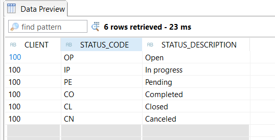
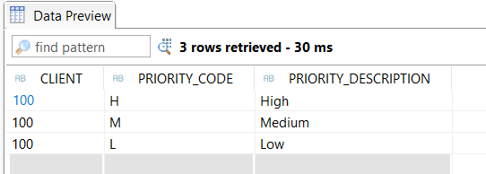

# SAP ABAP BTP Cloud Project 2
This is my second SAP ABAP Cloud project: Incident management system built with ABAP RAP (woth drafts) on SAP BTP. CDS views, behavior definitions, custom actions, validations, and a Fiori Elements UI via OData V4

## Tools
- Eclipse.
- BTP trial.
- My own notes from the Logali master's program manual.
- Claude Pro.

## Step 1: Domains
- ZDO_CHANGED_DATE_LGO
- ZDO_CREATION_DATE_LGO
- ZDO_CURR_STATUS_LGO
- ZDO_DESCRIPTION_LGO
- ZDO_HIS_ID_LGO
- ZDO_INCIDENT_ID_LGO
- ZDO_PREV_STATUS_LGO
- ZDO_PRIORITY_DESCRIPTION_LGO
- ZDO_PRIORITY_LGO
- ZDO_STATUS_DESCRIPTION_LGO
- ZDO_TEXT_LGO
- ZDO_TITLE_LGO
- ZDE_CUSTOMER_ID_LGO
- ZDE_PRIORITY_LGO
- ZDE_STATUS_LGO
- ZDE_TECHNICIAN_ID_LGO
- ZDE_WORK_ORDER_ID_LGO

*Curr means current and prev means previous*

## Step 2: Data elements
- ZDE_CHANGED_DATE_LGO
- ZDE_CREATION_DATE_LGO
- ZDE_CURR_STATUS_LGO
- ZDE_DESCRIPTION_LGO
- ZDE_HIS_ID_LGO
- ZDE_INCIDENT_ID_LGO
- ZDE_PREV_STATUS_LGO
- ZDE_PRIORITY2_LGO (I called it like this because ZDE_PRIORITY_LGO already exists in Project 1)
- ZDE_PRIORITY_DESCRIPTION_LGO
- ZDE_STATUS_DESCRIPTION_LGO
- ZDE_TEXT_LGO
- ZDE_TITLE_LGO

## Step 3: Tables
- ZDT_INCT_LGO (with foreign key status and priority)
- ZDT_INCT_H_LGO (with foreign key inc_uuid)
- ZDT_STATUS_LGO
- ZDT_PRIORITY_LGO

## Step 4: Fill status and priority tables with data
I created ZCL_STATUS_PRIORITY_DATA, a class implementing IF_OO_ADT_CLASSRUN o INSERT the fixed master data values into ZDT_STATUS_LGO and ZDT_PRIORITY_LGO.
Results in screenshots:

